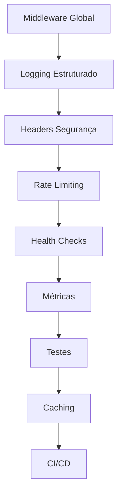

# AuthService - Análise e Recomendações de Melhorias

## 📋 Resumo Executivo

Este documento apresenta uma análise abrangente do projeto AuthService e propõe melhorias técnicas para torná-lo mais robusto, seguro e adequado para produção. O projeto demonstra uma arquitetura sólida baseada em Clean Architecture e padrões modernos, mas há oportunidades significativas de melhoria.

## 🏗️ 1. Análise da Arquitetura Atual

### ✅ Pontos Fortes Identificados

- **Clean Architecture**: Separação clara entre Domain, Application, Infrastructure e API
- **Padrão CQRS**: Implementação com Mediator para separação de comandos e queries
- **ASP.NET Core Identity**: Uso adequado para autenticação e autorização
- **Entity Framework Core**: Configuração apropriada com PostgreSQL
- **BuildingBlocks**: Componentes compartilhados bem estruturados
- **Validações Customizadas**: Implementação de validações de domínio
- **Localização**: Mensagens de erro em português

### ⚠️ Áreas que Precisam de Melhoria

- **Ausência de middleware de tratamento global de exceções**
- **Falta de headers de segurança**
- **Ausência de rate limiting**
- **Logging não estruturado**
- **Falta de health checks**
- **Ausência de CORS configurado**
- **Falta de testes automatizados**
- **Configurações de segurança básicas**

## 🔒 2. Melhorias de Segurança

### 2.1 Middleware de Segurança

**Prioridade: ALTA**

```csharp
// Implementar middleware para headers de segurança
public class SecurityHeadersMiddleware
{
    public async Task InvokeAsync(HttpContext context, RequestDelegate next)
    {
        context.Response.Headers.Add("X-Content-Type-Options", "nosniff");
        context.Response.Headers.Add("X-Frame-Options", "DENY");
        context.Response.Headers.Add("X-XSS-Protection", "1; mode=block");
        context.Response.Headers.Add("Referrer-Policy", "strict-origin-when-cross-origin");
        context.Response.Headers.Add("Content-Security-Policy", "default-src 'self'");
        
        await next(context);
    }
}
```

### 2.2 Rate Limiting

**Prioridade: ALTA**

```csharp
// Configuração de rate limiting
builder.Services.AddRateLimiter(options =>
{
    options.AddFixedWindowLimiter("AuthPolicy", opt =>
    {
        opt.PermitLimit = 10;
        opt.Window = TimeSpan.FromMinutes(1);
        opt.QueueProcessingOrder = QueueProcessingOrder.OldestFirst;
        opt.QueueLimit = 5;
    });
});
```

### 2.3 CORS Policy

**Prioridade: MÉDIA**

```csharp
builder.Services.AddCors(options =>
{
    options.AddPolicy("AuthServicePolicy", policy =>
    {
        policy.WithOrigins("https://localhost:3000", "https://yourdomain.com")
              .AllowedHeaders("Content-Type", "Authorization")
              .AllowedMethods("GET", "POST", "PUT", "DELETE")
              .AllowCredentials();
    });
});
```

### 2.4 JWT Security Enhancements

**Prioridade: ALTA**

- Implementar refresh tokens
- Configurar expiração adequada dos tokens
- Adicionar blacklist de tokens revogados
- Implementar rotação de chaves JWT

## 🚨 3. Gerenciamento de Exceções

### 3.1 Middleware Global de Tratamento de Erros

**Prioridade: CRÍTICA**

```csharp
public class GlobalExceptionMiddleware
{
    private readonly RequestDelegate _next;
    private readonly ILogger<GlobalExceptionMiddleware> _logger;

    public async Task InvokeAsync(HttpContext context)
    {
        try
        {
            await _next(context);
        }
        catch (Exception ex)
        {
            _logger.LogError(ex, "Erro não tratado: {Message}", ex.Message);
            await HandleExceptionAsync(context, ex);
        }
    }

    private static async Task HandleExceptionAsync(HttpContext context, Exception exception)
    {
        var response = exception switch
        {
            ValidationException => new ApiResponse<object>
            {
                Success = false,
                ErrorCode = "VALIDATION_ERROR",
                Message = "Dados inválidos",
                Errors = ((ValidationException)exception).Errors.ToList()
            },
            UnauthorizedAccessException => new ApiResponse<object>
            {
                Success = false,
                ErrorCode = "UNAUTHORIZED",
                Message = "Acesso não autorizado"
            },
            _ => new ApiResponse<object>
            {
                Success = false,
                ErrorCode = "INTERNAL_ERROR",
                Message = "Erro interno do servidor"
            }
        };

        context.Response.ContentType = "application/json";
        context.Response.StatusCode = GetStatusCode(exception);
        
        await context.Response.WriteAsync(JsonSerializer.Serialize(response));
    }
}
```

### 3.2 Logging Estruturado

**Prioridade: ALTA**

```csharp
// Configuração do Serilog
builder.Host.UseSerilog((context, configuration) =>
{
    configuration
        .ReadFrom.Configuration(context.Configuration)
        .Enrich.FromLogContext()
        .Enrich.WithMachineName()
        .Enrich.WithEnvironmentName()
        .WriteTo.Console(outputTemplate: "[{Timestamp:HH:mm:ss} {Level:u3}] {Message:lj} {Properties:j}{NewLine}{Exception}")
        .WriteTo.File("logs/authservice-.log", 
            rollingInterval: RollingInterval.Day,
            retainedFileCountLimit: 30);
});
```

## 📊 4. Performance e Monitoramento

### 4.1 Health Checks

**Prioridade: ALTA**

```csharp
builder.Services.AddHealthChecks()
    .AddNpgSql(builder.Configuration.GetConnectionString("DefaultConnection")!)
    .AddCheck<EmailServiceHealthCheck>("email_service")
    .AddCheck<JwtServiceHealthCheck>("jwt_service");

// Endpoint de health check
app.MapHealthChecks("/health", new HealthCheckOptions
{
    ResponseWriter = UIResponseWriter.WriteHealthCheckUIResponse
});
```

### 4.2 Métricas e Observabilidade

**Prioridade: MÉDIA**

```csharp
// Implementar métricas customizadas
builder.Services.AddSingleton<IMetrics, Metrics>();

// Configurar Application Insights ou Prometheus
builder.Services.AddApplicationInsightsTelemetry();
```

### 4.3 Caching Strategy

**Prioridade: MÉDIA**

```csharp
// Redis para cache distribuído
builder.Services.AddStackExchangeRedisCache(options =>
{
    options.Configuration = builder.Configuration.GetConnectionString("Redis");
});

// Cache em memória para dados locais
builder.Services.AddMemoryCache();
```

### 4.4 Otimizações de Banco de Dados

**Prioridade: MÉDIA**

- Implementar connection pooling otimizado
- Adicionar índices apropriados nas tabelas
- Configurar query timeout adequado
- Implementar retry policy para transações

## 🧪 5. Qualidade de Código

### 5.1 Testes Automatizados

**Prioridade: ALTA**

```
AuthService.Tests/
├── Unit/
│   ├── Domain/
│   │   └── UserValidationTests.cs
│   ├── Application/
│   │   └── RegisterUserCommandHandlerTests.cs
│   └── Infrastructure/
├── Integration/
│   ├── Controllers/
│   │   └── AuthControllerTests.cs
│   └── Database/
└── E2E/
    └── AuthenticationFlowTests.cs
```

### 5.2 Documentação da API

**Prioridade: MÉDIA**

```csharp
// Configuração avançada do Swagger
builder.Services.AddSwaggerGen(c =>
{
    c.SwaggerDoc("v1", new OpenApiInfo 
    { 
        Title = "AuthService API", 
        Version = "v1",
        Description = "API de Autenticação do BCommerce"
    });
    
    c.AddSecurityDefinition("Bearer", new OpenApiSecurityScheme
    {
        Description = "JWT Authorization header usando Bearer scheme",
        Name = "Authorization",
        In = ParameterLocation.Header,
        Type = SecuritySchemeType.ApiKey,
        Scheme = "Bearer"
    });
});
```

### 5.3 Validações e Contratos

**Prioridade: MÉDIA**

- Implementar FluentValidation para validações mais complexas
- Adicionar Data Annotations mais robustas
- Criar contratos de API bem definidos
- Implementar versionamento de API

## 🚀 6. DevOps e Deployment

### 6.1 Containerização

**Prioridade: ALTA**

```dockerfile
# Dockerfile otimizado
FROM mcr.microsoft.com/dotnet/aspnet:8.0 AS base
WORKDIR /app
EXPOSE 80
EXPOSE 443

FROM mcr.microsoft.com/dotnet/sdk:8.0 AS build
WORKDIR /src
COPY ["AuthService.Api/AuthService.Api.csproj", "AuthService.Api/"]
RUN dotnet restore "AuthService.Api/AuthService.Api.csproj"
COPY . .
WORKDIR "/src/AuthService.Api"
RUN dotnet build "AuthService.Api.csproj" -c Release -o /app/build

FROM build AS publish
RUN dotnet publish "AuthService.Api.csproj" -c Release -o /app/publish

FROM base AS final
WORKDIR /app
COPY --from=publish /app/publish .
ENTRYPOINT ["dotnet", "AuthService.Api.dll"]
```

### 6.2 CI/CD Pipeline

**Prioridade: ALTA**

```yaml
# GitHub Actions workflow
name: AuthService CI/CD
on:
  push:
    branches: [ main, develop ]
  pull_request:
    branches: [ main ]

jobs:
  test:
    runs-on: ubuntu-latest
    steps:
    - uses: actions/checkout@v3
    - name: Setup .NET
      uses: actions/setup-dotnet@v3
      with:
        dotnet-version: 8.0.x
    - name: Restore dependencies
      run: dotnet restore
    - name: Build
      run: dotnet build --no-restore
    - name: Test
      run: dotnet test --no-build --verbosity normal
```

### 6.3 Configurações de Ambiente

**Prioridade: MÉDIA**

```json
// appsettings.Production.json
{
  "ConnectionStrings": {
    "DefaultConnection": "#{DB_CONNECTION_STRING}#"
  },
  "JwtSettings": {
    "SecretKey": "#{JWT_SECRET_KEY}#",
    "Issuer": "#{JWT_ISSUER}#",
    "Audience": "#{JWT_AUDIENCE}#",
    "ExpirationInMinutes": 60
  },
  "Logging": {
    "LogLevel": {
      "Default": "Warning",
      "Microsoft.AspNetCore": "Warning"
    }
  }
}
```

## 📅 7. Roadmap de Implementação

### Fase 1 - Fundação (Semanas 1-2)
**Prioridade: CRÍTICA**

1. **Middleware de Tratamento Global de Exceções** (3 dias)
   - Implementar GlobalExceptionMiddleware
   - Padronizar respostas de erro
   - Testes unitários

2. **Logging Estruturado** (2 dias)
   - Configurar Serilog
   - Implementar correlation IDs
   - Configurar diferentes níveis de log

3. **Headers de Segurança** (1 dia)
   - Implementar SecurityHeadersMiddleware
   - Configurar políticas de segurança

### Fase 2 - Segurança (Semanas 3-4)
**Prioridade: ALTA**

1. **Rate Limiting** (2 dias)
   - Configurar políticas de rate limiting
   - Implementar diferentes limites por endpoint
   - Testes de carga

2. **JWT Security Enhancements** (5 dias)
   - Implementar refresh tokens
   - Adicionar blacklist de tokens
   - Rotação de chaves JWT

3. **CORS Policy** (1 dia)
   - Configurar políticas CORS apropriadas
   - Testes de integração

### Fase 3 - Monitoramento (Semanas 5-6)
**Prioridade: ALTA**

1. **Health Checks** (3 dias)
   - Implementar health checks para todos os serviços
   - Dashboard de monitoramento
   - Alertas automáticos

2. **Métricas e Observabilidade** (4 dias)
   - Configurar Application Insights
   - Implementar métricas customizadas
   - Dashboards de performance

### Fase 4 - Qualidade (Semanas 7-8)
**Prioridade: MÉDIA**

1. **Testes Automatizados** (7 dias)
   - Testes unitários (80% cobertura)
   - Testes de integração
   - Testes E2E básicos

2. **Documentação da API** (2 dias)
   - Swagger avançado
   - Documentação de contratos
   - Exemplos de uso

### Fase 5 - Performance (Semanas 9-10)
**Prioridade: MÉDIA**

1. **Caching Strategy** (3 dias)
   - Implementar Redis
   - Cache de queries frequentes
   - Invalidação de cache

2. **Otimizações de Banco** (4 dias)
   - Análise de performance
   - Índices otimizados
   - Connection pooling

### Fase 6 - DevOps (Semanas 11-12)
**Prioridade: BAIXA**

1. **Containerização** (3 dias)
   - Dockerfile otimizado
   - Docker Compose para desenvolvimento
   - Configurações de produção

2. **CI/CD Pipeline** (4 dias)
   - GitHub Actions
   - Deploy automatizado
   - Rollback automático

## 💰 Estimativa de Esforço

| Fase | Esforço (dias) | Recursos | Prioridade |
|------|----------------|----------|------------|
| Fase 1 - Fundação | 6 | 1 Dev Senior | CRÍTICA |
| Fase 2 - Segurança | 8 | 1 Dev Senior | ALTA |
| Fase 3 - Monitoramento | 7 | 1 Dev Senior + 1 DevOps | ALTA |
| Fase 4 - Qualidade | 9 | 1 Dev Senior + 1 QA | MÉDIA |
| Fase 5 - Performance | 7 | 1 Dev Senior + 1 DBA | MÉDIA |
| Fase 6 - DevOps | 7 | 1 DevOps | BAIXA |

**Total Estimado: 44 dias úteis (~9 semanas)**

## 🔗 Dependências Entre Tarefas



## 📋 Checklist de Implementação

### Segurança
- [ ] Middleware de tratamento global de exceções
- [ ] Headers de segurança (HSTS, CSP, etc.)
- [ ] Rate limiting por IP e usuário
- [ ] CORS policy configurada
- [ ] JWT com refresh tokens
- [ ] Blacklist de tokens revogados
- [ ] Validação de entrada robusta

### Monitoramento
- [ ] Health checks para todos os serviços
- [ ] Logging estruturado com Serilog
- [ ] Métricas de performance
- [ ] Alertas automáticos
- [ ] Dashboard de monitoramento

### Performance
- [ ] Cache distribuído (Redis)
- [ ] Connection pooling otimizado
- [ ] Índices de banco otimizados
- [ ] Compressão de resposta
- [ ] Paginação em queries

### Qualidade
- [ ] Testes unitários (>80% cobertura)
- [ ] Testes de integração
- [ ] Testes E2E
- [ ] Documentação da API
- [ ] Code review automatizado

### DevOps
- [ ] Dockerfile otimizado
- [ ] CI/CD pipeline
- [ ] Deploy automatizado
- [ ] Rollback automático
- [ ] Configurações por ambiente

## 🎯 Conclusão

O projeto AuthService possui uma base sólida com arquitetura bem estruturada. As melhorias propostas focarão em torná-lo production-ready, com ênfase em segurança, monitoramento e qualidade. A implementação deve seguir a priorização sugerida, começando pelas melhorias críticas de segurança e tratamento de erros.

O investimento estimado de 9 semanas resultará em um serviço robusto, seguro e escalável, adequado para ambientes de produção empresarial.