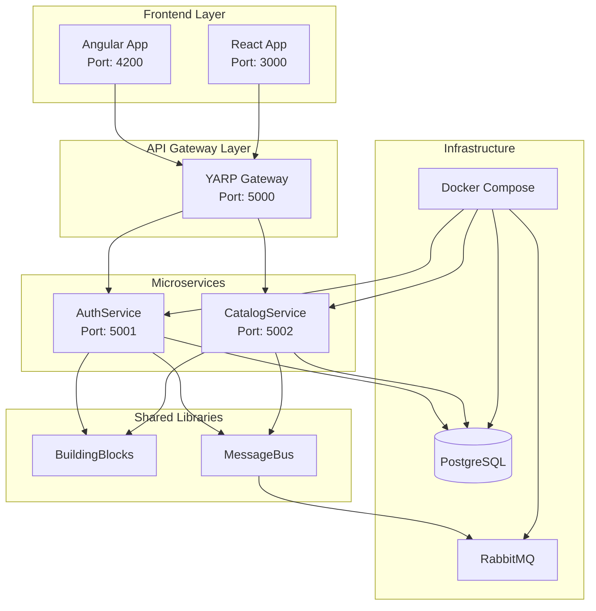

# Análise da Arquitetura do Projeto Bcommerce-Server

## 1. Visão Geral da Arquitetura

O projeto Bcommerce-Server implementa uma arquitetura de microserviços baseada em .NET 8, seguindo padrões modernos de desenvolvimento como Clean Architecture, CQRS, e Domain-Driven Design (DDD).



## 2. Estrutura de Serviços

### 2.1 AuthService (Completo e Funcional)

**Status**: ✅ Totalmente implementado e funcional

**Responsabilidades**:
- Autenticação e autorização de usuários
- Gerenciamento de identidade (ASP.NET Core Identity)
- Geração e validação de tokens JWT
- Operações de usuário (registro, login, perfil)
- Eventos de domínio via MessageBus

**Arquitetura Interna**:
```
AuthService/
├── AuthService.Api/          # Camada de apresentação
├── AuthService.Application/  # Camada de aplicação (CQRS)
├── AuthService.Domain/       # Camada de domínio
└── AuthService.Infrastructure/ # Camada de infraestrutura
```

**Endpoints Principais**:
- `POST /api/auth/register` - Registro de usuário
- `POST /api/auth/login` - Login de usuário
- `GET /api/auth/confirm-email` - Confirmação de email
- `POST /api/auth/resend-activation-token` - Reenvio de token
- `POST /api/auth/logout` - Logout
- `POST /api/auth/refresh-token` - Renovação de token
- `POST /api/auth/forgot-password` - Recuperação de senha
- `POST /api/auth/reset-password` - Reset de senha
- `GET /api/auth/profile` - Perfil do usuário
- `PUT /api/auth/profile` - Atualização de perfil

**Tecnologias**:
- ASP.NET Core Identity
- Entity Framework Core
- PostgreSQL
- JWT Authentication
- MessageBus (RabbitMQ)
- Health Checks

### 2.2 CatalogService (Template Básico)

**Status**: ⚠️ Implementação básica (template padrão)

**Estado Atual**:
- Apenas template padrão do .NET
- Endpoint WeatherForecast de exemplo
- Sem implementação de negócio

**Necessidades de Implementação**:
- Estrutura Clean Architecture
- Entidades de produto/catálogo
- CRUD de produtos
- Categorização
- Busca e filtros
- Integração com BuildingBlocks

### 2.3 BuildingBlocks (Biblioteca Compartilhada)

**Status**: ✅ Bem estruturado e funcional

**Componentes**:

#### Data Layer
- `IRepository<T>` - Interface genérica de repositório
- `IUnitOfWork` - Padrão Unit of Work

#### Domain Layer
- `Entity` - Classe base para entidades
- `ValueObject` - Classe base para objetos de valor

#### Mediator Pattern
- `IMediator` - Interface do mediator
- `IRequest<T>` / `IRequestHandler<T>` - Padrão Request/Response
- `INotification` / `INotificationHandler` - Padrão de notificações

#### Middlewares
- `ExceptionHandlingMiddleware` - Tratamento global de exceções
- `ModelValidationMiddleware` - Validação de modelos
- `PerformanceMonitoringMiddleware` - Monitoramento de performance
- `RateLimitingMiddleware` - Limitação de taxa
- `RequestResponseLoggingMiddleware` - Log de requisições
- `SecurityHeadersMiddleware` - Headers de segurança

#### Result Pattern
- `ApiResponse<T>` - Resposta padronizada da API
- `PagedResult<T>` - Resultado paginado

#### Validations
- `ValidationException` - Exceção de validação
- `ValidationHandler` - Manipulador de validações
- `Error` - Classe de erro padronizada

## 3. Frontend Applications

### 3.1 Angular Application
- **Localização**: `Src/Frontend/Angular/bcommerce-client-angular/`
- **Status**: Estrutura básica criada
- **Port**: 4200

### 3.2 React Application
- **Localização**: `Src/Frontend/React/bcommerce-client-react/`
- **Status**: Estrutura básica criada
- **Port**: 3000

## 4. API Gateway (Atual)

### 4.1 Estado Atual
**Status**: ⚠️ Template básico sem configuração YARP

**Problemas Identificados**:
- Apenas template padrão do .NET
- Sem pacote YARP instalado
- Sem configuração de roteamento
- Endpoint WeatherForecast de exemplo

### 4.2 Necessidades para YARP
- Instalação do pacote `Yarp.ReverseProxy`
- Configuração de rotas para serviços
- Políticas de load balancing
- Health checks dos serviços
- Autenticação/Autorização
- Rate limiting
- CORS policies

## 5. Infraestrutura

### 5.1 Docker Compose
**Localização**: `Infra/docker-compose.yml`

**Serviços Configurados**:
- PostgreSQL (múltiplas instâncias por serviço)
- RabbitMQ (com management UI)
- Scripts de inicialização por serviço

### 5.2 MessageBus (RabbitMQ)
**Status**: ✅ Totalmente configurado

**Características**:
- Implementação completa com RabbitMQ
- Padrões Event/Command
- Auto-discovery de handlers
- Connection management
- Error handling e retry policies

## 6. Padrões Arquiteturais Implementados

### 6.1 Clean Architecture
- ✅ **AuthService**: Implementação completa
- ❌ **CatalogService**: Não implementado
- ✅ **BuildingBlocks**: Suporte completo

### 6.2 CQRS (Command Query Responsibility Segregation)
- ✅ **AuthService**: Commands e Queries separados
- ❌ **CatalogService**: Não implementado
- ✅ **BuildingBlocks**: Mediator pattern implementado

### 6.3 Domain-Driven Design (DDD)
- ✅ **AuthService**: Entidades, Value Objects, Domain Events
- ❌ **CatalogService**: Não implementado
- ✅ **BuildingBlocks**: Suporte para DDD

### 6.4 Event-Driven Architecture
- ✅ **MessageBus**: RabbitMQ configurado
- ✅ **AuthService**: Eventos de domínio implementados
- ❌ **CatalogService**: Não implementado

## 7. Segurança

### 7.1 Autenticação
- ✅ JWT Authentication (AuthService)
- ✅ ASP.NET Core Identity
- ✅ Refresh Token mechanism
- ✅ Email confirmation

### 7.2 Autorização
- ✅ Role-based authorization
- ✅ Claims-based authorization
- ⚠️ API Gateway: Não configurado

### 7.3 Middlewares de Segurança
- ✅ Security Headers
- ✅ Rate Limiting
- ✅ Request Validation
- ✅ Exception Handling

## 8. Monitoramento e Observabilidade

### 8.1 Health Checks
- ✅ **AuthService**: Database, Identity, MessageBus
- ❌ **CatalogService**: Não implementado
- ⚠️ **API Gateway**: Não configurado

### 8.2 Logging
- ✅ Structured logging (Serilog pattern)
- ✅ Request/Response logging
- ✅ Performance monitoring

## 9. Qualidade de Código

### 9.1 Pontos Fortes
- ✅ Separação clara de responsabilidades
- ✅ Padrões consistentes no AuthService
- ✅ BuildingBlocks bem estruturado
- ✅ Documentação de API (Swagger)
- ✅ Tratamento de erros padronizado

### 9.2 Áreas de Melhoria
- ❌ CatalogService precisa de implementação completa
- ❌ API Gateway precisa de configuração YARP
- ⚠️ Testes unitários não identificados
- ⚠️ Documentação técnica limitada

## 10. Próximos Passos Recomendados

### 10.1 Prioridade Alta
1. **Configurar API Gateway com YARP**
2. **Implementar CatalogService completo**
3. **Configurar autenticação no Gateway**

### 10.2 Prioridade Média
1. Implementar testes unitários
2. Configurar CI/CD
3. Adicionar métricas e monitoring
4. Implementar cache distribuído

### 10.3 Prioridade Baixa
1. Implementar novos microserviços
2. Otimizações de performance
3. Documentação técnica expandida

## 11. Conclusão

O projeto apresenta uma base sólida com o **AuthService** completamente funcional e o **BuildingBlocks** bem estruturado. O principal gargalo atual é a falta de configuração do **API Gateway** e a implementação básica do **CatalogService**. 

A arquitetura escolhida é moderna e escalável, seguindo as melhores práticas de microserviços. Com a implementação do YARP no Gateway e a evolução do CatalogService, o projeto estará pronto para produção.