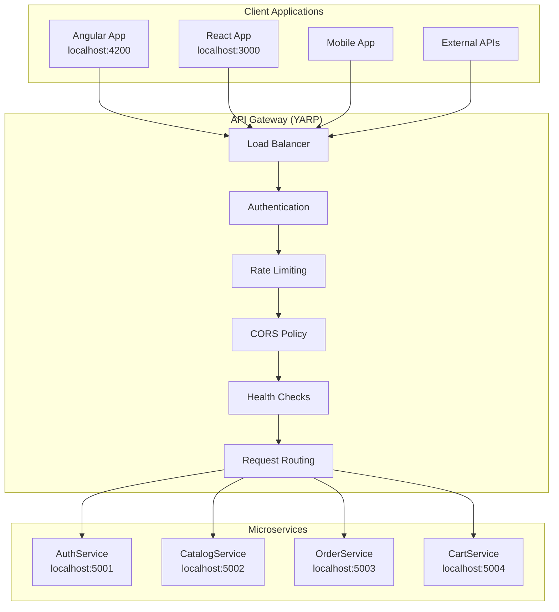

# Configuração do API Gateway com YARP

## 1. Visão Geral

Este documento detalha a configuração completa do API Gateway usando YARP (Yet Another Reverse Proxy) para o projeto Bcommerce-Server, incluindo roteamento, autenticação, políticas de segurança e integração com os microserviços.

## 2. Arquitetura do Gateway



## 3. Configuração do Projeto

### 3.1 Dependências Necessárias

**ApiGateway.csproj**:
```xml
<Project Sdk="Microsoft.NET.Sdk.Web">
    <PropertyGroup>
        <TargetFramework>net8.0</TargetFramework>
        <Nullable>enable</Nullable>
        <ImplicitUsings>enable</ImplicitUsings>
    </PropertyGroup>

    <ItemGroup>
        <PackageReference Include="Yarp.ReverseProxy" Version="2.1.0" />
        <PackageReference Include="Microsoft.AspNetCore.Authentication.JwtBearer" Version="8.0.11" />
        <PackageReference Include="Microsoft.Extensions.Diagnostics.HealthChecks" Version="8.0.11" />
        <PackageReference Include="Microsoft.Extensions.Diagnostics.HealthChecks.Abstractions" Version="8.0.11" />
        <PackageReference Include="AspNetCoreRateLimit" Version="5.0.0" />
        <PackageReference Include="Serilog.AspNetCore" Version="8.0.2" />
        <PackageReference Include="Swashbuckle.AspNetCore" Version="6.6.2" />
    </ItemGroup>

    <ItemGroup>
        <ProjectReference Include="..\..\BuildingBlocks\BuildingBlocks\BuildingBlocks.csproj" />
    </ItemGroup>
</Project>
```

### 3.2 Configuração Principal (Program.cs)

```csharp
using Microsoft.AspNetCore.Authentication.JwtBearer;
using Microsoft.IdentityModel.Tokens;
using System.Text;
using BuildingBlocks.Extensions;
using BuildingBlocks.Middlewares;

var builder = WebApplication.CreateBuilder(args);

// ===== CONFIGURAÇÃO DE SERVIÇOS =====

// 1. YARP Reverse Proxy
builder.Services.AddReverseProxy()
    .LoadFromConfig(builder.Configuration.GetSection("ReverseProxy"));

// 2. Autenticação JWT
var jwtSettings = builder.Configuration.GetSection("JwtSettings");
var secretKey = jwtSettings["Secret"] ?? throw new InvalidOperationException("JWT Secret não configurado");

builder.Services.AddAuthentication(JwtBearerDefaults.AuthenticationScheme)
    .AddJwtBearer(options =>
    {
        options.TokenValidationParameters = new TokenValidationParameters
        {
            ValidateIssuer = true,
            ValidateAudience = true,
            ValidateLifetime = true,
            ValidateIssuerSigningKey = true,
            ValidIssuer = jwtSettings["Issuer"],
            ValidAudience = jwtSettings["Audience"],
            IssuerSigningKey = new SymmetricSecurityKey(Encoding.UTF8.GetBytes(secretKey)),
            ClockSkew = TimeSpan.Zero
        };
    });

// 3. Autorização
builder.Services.AddAuthorization(options =>
{
    options.AddPolicy("RequireAuthentication", policy =>
        policy.RequireAuthenticatedUser());
    
    options.AddPolicy("AdminOnly", policy =>
        policy.RequireRole("Admin"));
    
    options.AddPolicy("UserOrAdmin", policy =>
        policy.RequireRole("User", "Admin"));
});

// 4. CORS
builder.Services.AddCors(options =>
{
    options.AddPolicy("AllowFrontendApps", policy =>
    {
        policy.WithOrigins(
                "http://localhost:4200",  // Angular
                "http://localhost:3000",  // React
                "https://localhost:4200", // Angular HTTPS
                "https://localhost:3000"  // React HTTPS
            )
            .AllowAnyHeader()
            .AllowAnyMethod()
            .AllowCredentials();
    });
});

// 5. Rate Limiting
builder.Services.AddMemoryCache();
builder.Services.Configure<IpRateLimitOptions>(builder.Configuration.GetSection("IpRateLimiting"));
builder.Services.Configure<IpRateLimitPolicies>(builder.Configuration.GetSection("IpRateLimitPolicies"));
builder.Services.AddInMemoryRateLimiting();
builder.Services.AddSingleton<IRateLimitConfiguration, RateLimitConfiguration>();

// 6. Health Checks
builder.Services.AddHealthChecks()
    .AddCheck("self", () => HealthCheckResult.Healthy())
    .AddUrlGroup(new Uri("http://localhost:5001/health"), "authservice")
    .AddUrlGroup(new Uri("http://localhost:5002/health"), "catalogservice");

// 7. Logging
builder.Services.AddLogging();

// 8. Swagger (apenas para desenvolvimento)
if (builder.Environment.IsDevelopment())
{
    builder.Services.AddEndpointsApiExplorer();
    builder.Services.AddSwaggerGen(c =>
    {
        c.SwaggerDoc("v1", new() { Title = "Bcommerce API Gateway", Version = "v1" });
        c.AddSecurityDefinition("Bearer", new()
        {
            Description = "JWT Authorization header using the Bearer scheme.",
            Name = "Authorization",
            In = ParameterLocation.Header,
            Type = SecuritySchemeType.ApiKey,
            Scheme = "Bearer"
        });
        c.AddSecurityRequirement(new()
        {
            {
                new()
                {
                    Reference = new() { Type = ReferenceType.SecurityScheme, Id = "Bearer" }
                },
                Array.Empty<string>()
            }
        });
    });
}

var app = builder.Build();

// ===== CONFIGURAÇÃO DO PIPELINE =====

// 1. CORS (deve vir primeiro)
app.UseCors("AllowFrontendApps");

// 2. HTTPS Redirection
app.UseHttpsRedirection();

// 3. Swagger (apenas desenvolvimento)
if (app.Environment.IsDevelopment())
{
    app.UseSwagger();
    app.UseSwaggerUI(c =>
    {
        c.SwaggerEndpoint("/swagger/v1/swagger.json", "Bcommerce API Gateway v1");
        c.RoutePrefix = "swagger";
    });
}

// 4. Rate Limiting
app.UseIpRateLimiting();

// 5. BuildingBlocks Middlewares
app.UseBuildingBlocksMiddleware(app.Environment.IsDevelopment());

// 6. Autenticação e Autorização
app.UseAuthentication();
app.UseAuthorization();

// 7. Health Checks
app.MapHealthChecks("/health");
app.MapHealthChecks("/health/ready");
app.MapHealthChecks("/health/live");

// 8. YARP Reverse Proxy
app.MapReverseProxy();

app.Run();
```

## 4. Configuração de Roteamento (appsettings.json)

```json
{
  "Logging": {
    "LogLevel": {
      "Default": "Information",
      "Microsoft.AspNetCore": "Warning",
      "Yarp": "Information"
    }
  },
  "AllowedHosts": "*",
  
  "JwtSettings": {
    "Secret": "BcommerceApiGatewaySecretKeyForJwtTokenValidation2024!@#$%",
    "Issuer": "BcommerceAuthService",
    "Audience": "BcommerceClients",
    "ExpirationInMinutes": 60
  },

  "ReverseProxy": {
    "Routes": {
      "auth-route": {
        "ClusterId": "auth-cluster",
        "Match": {
          "Path": "/api/auth/{**catch-all}"
        },
        "Transforms": [
          { "PathPattern": "/api/auth/{**catch-all}" }
        ]
      },
      "catalog-route": {
        "ClusterId": "catalog-cluster",
        "Match": {
          "Path": "/api/catalog/{**catch-all}"
        },
        "Transforms": [
          { "PathPattern": "/api/catalog/{**catch-all}" }
        ],
        "AuthorizationPolicy": "RequireAuthentication"
      },
      "order-route": {
        "ClusterId": "order-cluster",
        "Match": {
          "Path": "/api/orders/{**catch-all}"
        },
        "Transforms": [
          { "PathPattern": "/api/orders/{**catch-all}" }
        ],
        "AuthorizationPolicy": "RequireAuthentication"
      },
      "cart-route": {
        "ClusterId": "cart-cluster",
        "Match": {
          "Path": "/api/cart/{**catch-all}"
        },
        "Transforms": [
          { "PathPattern": "/api/cart/{**catch-all}" }
        ],
        "AuthorizationPolicy": "RequireAuthentication"
      },
      "admin-route": {
        "ClusterId": "auth-cluster",
        "Match": {
          "Path": "/api/admin/{**catch-all}"
        },
        "Transforms": [
          { "PathPattern": "/api/admin/{**catch-all}" }
        ],
        "AuthorizationPolicy": "AdminOnly"
      }
    },
    
    "Clusters": {
      "auth-cluster": {
        "Destinations": {
          "auth-service": {
            "Address": "http://localhost:5001/"
          }
        },
        "HealthCheck": {
          "Active": {
            "Enabled": true,
            "Interval": "00:00:30",
            "Timeout": "00:00:05",
            "Policy": "ConsecutiveFailures",
            "Path": "/health"
          }
        },
        "LoadBalancingPolicy": "RoundRobin"
      },
      "catalog-cluster": {
        "Destinations": {
          "catalog-service": {
            "Address": "http://localhost:5002/"
          }
        },
        "HealthCheck": {
          "Active": {
            "Enabled": true,
            "Interval": "00:00:30",
            "Timeout": "00:00:05",
            "Policy": "ConsecutiveFailures",
            "Path": "/health"
          }
        },
        "LoadBalancingPolicy": "RoundRobin"
      },
      "order-cluster": {
        "Destinations": {
          "order-service": {
            "Address": "http://localhost:5003/"
          }
        },
        "HealthCheck": {
          "Active": {
            "Enabled": true,
            "Interval": "00:00:30",
            "Timeout": "00:00:05",
            "Policy": "ConsecutiveFailures",
            "Path": "/health"
          }
        },
        "LoadBalancingPolicy": "RoundRobin"
      },
      "cart-cluster": {
        "Destinations": {
          "cart-service": {
            "Address": "http://localhost:5004/"
          }
        },
        "HealthCheck": {
          "Active": {
            "Enabled": true,
            "Interval": "00:00:30",
            "Timeout": "00:00:05",
            "Policy": "ConsecutiveFailures",
            "Path": "/health"
          }
        },
        "LoadBalancingPolicy": "RoundRobin"
      }
    }
  },

  "IpRateLimiting": {
    "EnableEndpointRateLimiting": true,
    "StackBlockedRequests": false,
    "RealIpHeader": "X-Real-IP",
    "ClientIdHeader": "X-ClientId",
    "HttpStatusCode": 429,
    "GeneralRules": [
      {
        "Endpoint": "*",
        "Period": "1m",
        "Limit": 100
      },
      {
        "Endpoint": "*",
        "Period": "1h",
        "Limit": 1000
      }
    ]
  },

  "IpRateLimitPolicies": {
    "IpRules": [
      {
        "Ip": "127.0.0.1",
        "Rules": [
          {
            "Endpoint": "*",
            "Period": "1m",
            "Limit": 1000
          }
        ]
      }
    ]
  }
}
```

## 5. Configuração de Desenvolvimento (appsettings.Development.json)

```json
{
  "Logging": {
    "LogLevel": {
      "Default": "Debug",
      "Microsoft.AspNetCore": "Information",
      "Yarp": "Debug"
    }
  },

  "JwtSettings": {
    "Secret": "BcommerceApiGatewayDevelopmentSecretKeyForJwtTokenValidation2024!@#$%",
    "Issuer": "BcommerceAuthService",
    "Audience": "BcommerceClients",
    "ExpirationInMinutes": 1440
  },

  "ReverseProxy": {
    "Clusters": {
      "auth-cluster": {
        "Destinations": {
          "auth-service": {
            "Address": "http://localhost:5001/"
          }
        }
      },
      "catalog-cluster": {
        "Destinations": {
          "catalog-service": {
            "Address": "http://localhost:5002/"
          }
        }
      }
    }
  },

  "IpRateLimiting": {
    "GeneralRules": [
      {
        "Endpoint": "*",
        "Period": "1m",
        "Limit": 1000
      }
    ]
  }
}
```

## 6. Configuração de Produção

### 6.1 Docker Compose Integration

```yaml
# Adição ao docker-compose.yml existente
services:
  # ... outros serviços ...

  api-gateway:
    build:
      context: ../Src/ApiGateway/ApiGateway
      dockerfile: Dockerfile
    container_name: bcommerce-api-gateway
    ports:
      - "5000:8080"
    environment:
      - ASPNETCORE_ENVIRONMENT=Production
      - ASPNETCORE_URLS=http://+:8080
    depends_on:
      - auth-service
      - catalog-service
    networks:
      - bcommerce-network
    restart: unless-stopped
    healthcheck:
      test: ["CMD", "curl", "-f", "http://localhost:8080/health"]
      interval: 30s
      timeout: 10s
      retries: 3
      start_period: 40s
```

### 6.2 Dockerfile para API Gateway

```dockerfile
FROM mcr.microsoft.com/dotnet/aspnet:8.0 AS base
WORKDIR /app
EXPOSE 8080

FROM mcr.microsoft.com/dotnet/sdk:8.0 AS build
WORKDIR /src
COPY ["ApiGateway.csproj", "."]
COPY ["../../BuildingBlocks/BuildingBlocks/BuildingBlocks.csproj", "BuildingBlocks/"]
RUN dotnet restore "ApiGateway.csproj"
COPY . .
COPY ../../BuildingBlocks/BuildingBlocks/ BuildingBlocks/
WORKDIR "/src"
RUN dotnet build "ApiGateway.csproj" -c Release -o /app/build

FROM build AS publish
RUN dotnet publish "ApiGateway.csproj" -c Release -o /app/publish /p:UseAppHost=false

FROM base AS final
WORKDIR /app
COPY --from=publish /app/publish .
ENTRYPOINT ["dotnet", "ApiGateway.dll"]
```

## 7. Políticas de Segurança Avançadas

### 7.1 Rate Limiting por Endpoint

```json
{
  "IpRateLimiting": {
    "EndpointWhitelist": [
      "get:/health",
      "get:/health/ready",
      "get:/health/live"
    ],
    "ClientWhitelist": [
      "dev-client-1"
    ],
    "GeneralRules": [
      {
        "Endpoint": "post:/api/auth/login",
        "Period": "1m",
        "Limit": 5
      },
      {
        "Endpoint": "post:/api/auth/register",
        "Period": "1h",
        "Limit": 3
      },
      {
        "Endpoint": "get:/api/catalog/*",
        "Period": "1m",
        "Limit": 200
      }
    ]
  }
}
```

### 7.2 Circuit Breaker Pattern

```csharp
// Adicionar ao Program.cs
builder.Services.AddHttpClient("AuthService", client =>
{
    client.BaseAddress = new Uri("http://localhost:5001/");
})
.AddPolicyHandler(GetRetryPolicy())
.AddPolicyHandler(GetCircuitBreakerPolicy());

static IAsyncPolicy<HttpResponseMessage> GetRetryPolicy()
{
    return HttpPolicyExtensions
        .HandleTransientHttpError()
        .WaitAndRetryAsync(
            retryCount: 3,
            sleepDurationProvider: retryAttempt => TimeSpan.FromSeconds(Math.Pow(2, retryAttempt)));
}

static IAsyncPolicy<HttpResponseMessage> GetCircuitBreakerPolicy()
{
    return HttpPolicyExtensions
        .HandleTransientHttpError()
        .CircuitBreakerAsync(
            handledEventsAllowedBeforeBreaking: 3,
            durationOfBreak: TimeSpan.FromSeconds(30));
}
```

## 8. Monitoramento e Observabilidade

### 8.1 Health Checks Customizados

```csharp
public class ServiceHealthCheck : IHealthCheck
{
    private readonly HttpClient _httpClient;
    private readonly string _serviceUrl;

    public ServiceHealthCheck(HttpClient httpClient, string serviceUrl)
    {
        _httpClient = httpClient;
        _serviceUrl = serviceUrl;
    }

    public async Task<HealthCheckResult> CheckHealthAsync(
        HealthCheckContext context,
        CancellationToken cancellationToken = default)
    {
        try
        {
            var response = await _httpClient.GetAsync($"{_serviceUrl}/health", cancellationToken);
            
            if (response.IsSuccessStatusCode)
            {
                return HealthCheckResult.Healthy($"Service at {_serviceUrl} is healthy");
            }
            
            return HealthCheckResult.Unhealthy($"Service at {_serviceUrl} returned {response.StatusCode}");
        }
        catch (Exception ex)
        {
            return HealthCheckResult.Unhealthy($"Service at {_serviceUrl} is unreachable", ex);
        }
    }
}
```

### 8.2 Métricas e Logging

```csharp
// Middleware customizado para métricas
public class MetricsMiddleware
{
    private readonly RequestDelegate _next;
    private readonly ILogger<MetricsMiddleware> _logger;

    public MetricsMiddleware(RequestDelegate next, ILogger<MetricsMiddleware> logger)
    {
        _next = next;
        _logger = logger;
    }

    public async Task InvokeAsync(HttpContext context)
    {
        var stopwatch = Stopwatch.StartNew();
        
        try
        {
            await _next(context);
        }
        finally
        {
            stopwatch.Stop();
            
            _logger.LogInformation(
                "Request {Method} {Path} completed in {ElapsedMilliseconds}ms with status {StatusCode}",
                context.Request.Method,
                context.Request.Path,
                stopwatch.ElapsedMilliseconds,
                context.Response.StatusCode);
        }
    }
}
```

## 9. Testes e Validação

### 9.1 Testes de Integração

```csharp
[Test]
public async Task Gateway_Should_Route_Auth_Requests()
{
    // Arrange
    var client = _factory.CreateClient();
    var loginRequest = new
    {
        Email = "test@example.com",
        Password = "Test123!"
    };

    // Act
    var response = await client.PostAsJsonAsync("/api/auth/login", loginRequest);

    // Assert
    response.StatusCode.Should().Be(HttpStatusCode.OK);
}

[Test]
public async Task Gateway_Should_Enforce_Rate_Limiting()
{
    // Arrange
    var client = _factory.CreateClient();
    
    // Act - Fazer muitas requisições rapidamente
    var tasks = Enumerable.Range(0, 10)
        .Select(_ => client.GetAsync("/api/catalog/products"));
    
    var responses = await Task.WhenAll(tasks);
    
    // Assert
    responses.Should().Contain(r => r.StatusCode == HttpStatusCode.TooManyRequests);
}
```

### 9.2 Scripts de Teste

```bash
#!/bin/bash
# test-gateway.sh

echo "Testing API Gateway..."

# Test health endpoint
echo "1. Testing health endpoint..."
curl -f http://localhost:5000/health || exit 1

# Test auth service routing
echo "2. Testing auth service routing..."
curl -f http://localhost:5000/api/auth/health || exit 1

# Test catalog service routing
echo "3. Testing catalog service routing..."
curl -f http://localhost:5000/api/catalog/health || exit 1

# Test rate limiting
echo "4. Testing rate limiting..."
for i in {1..10}; do
  curl -s -o /dev/null -w "%{http_code}\n" http://localhost:5000/api/catalog/products
done

echo "All tests completed!"
```

## 10. Deployment e DevOps

### 10.1 CI/CD Pipeline

```yaml
# .github/workflows/api-gateway.yml
name: API Gateway CI/CD

on:
  push:
    paths:
      - 'Src/ApiGateway/**'
  pull_request:
    paths:
      - 'Src/ApiGateway/**'

jobs:
  test:
    runs-on: ubuntu-latest
    steps:
      - uses: actions/checkout@v3
      - name: Setup .NET
        uses: actions/setup-dotnet@v3
        with:
          dotnet-version: '8.0.x'
      
      - name: Restore dependencies
        run: dotnet restore Src/ApiGateway/ApiGateway/ApiGateway.csproj
      
      - name: Build
        run: dotnet build Src/ApiGateway/ApiGateway/ApiGateway.csproj --no-restore
      
      - name: Test
        run: dotnet test Src/ApiGateway/ApiGateway.Tests/ --no-build --verbosity normal

  deploy:
    needs: test
    runs-on: ubuntu-latest
    if: github.ref == 'refs/heads/main'
    steps:
      - name: Deploy to staging
        run: echo "Deploy to staging environment"
```

## 11. Conclusão

Esta configuração do API Gateway com YARP fornece:

### ✅ **Funcionalidades Implementadas**
- **Roteamento inteligente** para todos os microserviços
- **Autenticação JWT** centralizada
- **Rate limiting** por IP e endpoint
- **Health checks** automáticos
- **CORS** configurado para frontends
- **Load balancing** com failover
- **Logging e monitoramento** integrados

### 🔧 **Benefícios**
- **Ponto único de entrada** para todas as APIs
- **Segurança centralizada** e consistente
- **Escalabilidade** através de load balancing
- **Observabilidade** completa do tráfego
- **Facilidade de manutenção** e deployment

### 🚀 **Próximos Passos**
1. Implementar cache distribuído (Redis)
2. Adicionar métricas avançadas (Prometheus)
3. Configurar service discovery automático
4. Implementar API versioning
5. Adicionar transformações de request/response customizadas

O API Gateway está agora pronto para ser o ponto central de acesso para toda a arquitetura de microserviços do Bcommerce-Server.